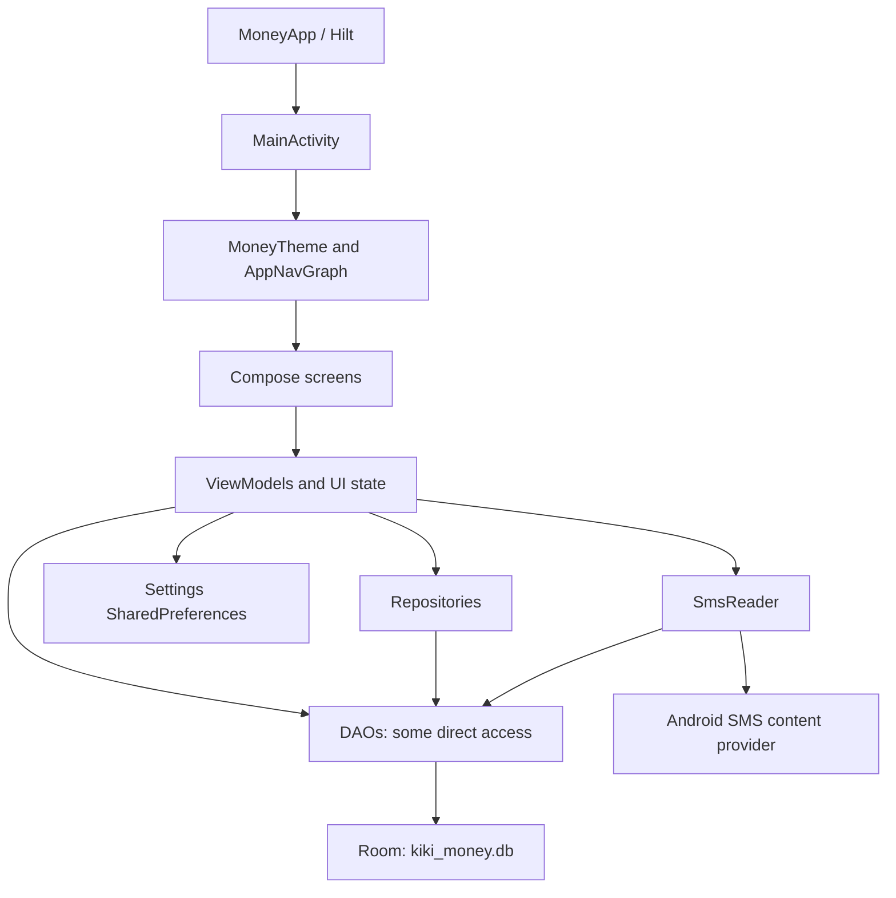
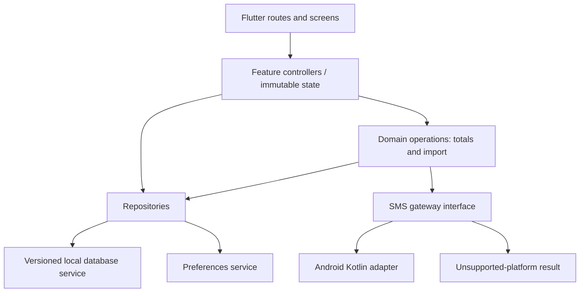

# Money Mobile Application — software architecture

## Current architecture

The current application is a single Android `app` module using Kotlin, Jetpack Compose, Navigation Compose, Room, Hilt and coroutines/Flow. The declared configuration is compile/target SDK 35, minimum SDK 26, JVM target 21 and application version 1.0 (code 1). The version catalog declares Kotlin 2.1.0, Android Gradle Plugin 8.7.3, Room 2.7.1 and Hilt 2.57.1. These are source declarations, not verified compatible build results.



This is an MVVM-oriented design with mixed boundaries. Transaction and category ViewModels use repositories; home, manual entry, journal and bank tracking access DAOs directly. ViewModels reside under `data/local/viewModel`, and screen code owns some validation, aggregation and asynchronous writes. Dependency injection is mostly Hilt, with manual ViewModel factory files also present. There is no separate domain layer or evidenced remote backend.

## Navigation

Registered destinations in AppNavGraph.kt are `home`, `add_transaction`, `journal`, `transactions`, `transactions/{id}`, `transactions/{id}/edit`, `sms`, `debts`, `settings`, `settings/appearance`, `settings/general`, `settings/categories`, `settings/data` and `settings/banks`. Home is the start destination. Transaction IDs are integer arguments. Journal owns its internal list/editor/view navigation.

`add_spend`, `planned` and `analytics` are declared in Screen.kt but have no registered destinations. Sms and SmsReader declare the same route string. The debt route invokes an empty function.

## Persistence model

MoneyDatabase declares version **8**, schema export enabled and five entities. DatabaseModule opens `kiki_money.db`, seeds categories and bank groups on creation, registers placeholder migration objects from 1→2 through 6→7 and enables destructive fallback. A 7→8 migration is absent. Schema-export configuration alone is not evidence of usable migration fixtures.

| Table | Fields and current representation |
| --- | --- |
| transactions | id: generated Int; title: String; amount: Double; type: String; categoryId: Int; note: String; receiver: required String; date: ISO String; source: MANUAL/SMS default MANUAL; rawSmsBody: String default empty; isEdited: Boolean default false; bankAccountId: nullable Int |
| categories | id: generated Int; name: String; icon: String; color: ARGB String; isDefault: Boolean; isActive: Boolean |
| bank_accounts | id: generated Int; senderId: String; displayName: String; accountType: BANK/UPI/CARD; isTracked: Boolean; iconEmoji: String; lastSyncedAt: nullable epoch milliseconds |
| journal_entries | id: generated Int; title: String; text: String; date: epoch milliseconds |
| debts | id: generated Int; personName: String; amount: Double; direction: String; description: String; dueDate: nullable epoch milliseconds; isSettled: Boolean; createdAt: epoch milliseconds; transactionId: required Int |

Transaction.categoryId, Transaction.bankAccountId and Debt.transactionId are logical references: entity annotations do not declare foreign keys. No unique SMS identity or sender-key constraint is declared. Spend (LocalDate-based) and PlannedSpend models exist but are not registered entities in MoneyDatabase; SpendDao is not exposed by it.

Settings use the `settings` SharedPreferences file, separate from Room. Keys include `theme`, `dynamic_color`, `compact_mode`, `show_balance`, `animations`, `currency`, `date_format`, `week_start`, `show_decimals`, `monthly_budget` and `auto_backup`.

## Current flows and failure boundaries

- Manual save: Compose validates → AddTransactionViewModel → TransactionDao insert → navigate back. Creation currently omits required receiver.
- Transaction reads: repository exposes DAO Flow → Compose collects; month filtering and summaries also run in UI. DAO monthly aggregates recognize numeric type strings only.
- SMS: permission request → screen starts ViewModel → SmsReader queries device and tracked banks → parser/filter → repository inserts → bank DAO updates sync timestamp. There is no atomic import batch or stable import identity.
- Journal: screen-local state controls panes → ViewModel calls DAO directly → Flow refreshes list.
- Theme: root collects SettingsViewModel state → MoneyTheme uses theme and dynamic-color choice. Other preferences need explicit consumers.

TransactionDao.getTransactionsByDate compares Long boundaries against a String date field. TransactionRepository.exists actually inserts a transaction. Both names/contracts must be corrected before reuse. See [implementation risks](implementation.md) for the full actionable list.

## Proposed Flutter architecture

This is a design proposal for the rewrite, not code already created. Use a feature-organized UI with explicit presentation state, repository interfaces and replaceable storage/platform services. This follows Flutter's separation of views/ViewModels, repositories and services. [Flutter architecture guide](https://docs.flutter.dev/app-architecture/guide)



Proposed ownership:

| Component | Responsibility |
| --- | --- |
| App composition root | Construct services/repositories/controllers, routes, settings and theme |
| Feature screens | Render state and forward user actions; no direct SQL or SMS access |
| Controllers | Loading/saving/error states, validation feedback, subscriptions and operation coordination |
| Domain operations | Money/date normalization, expense/income summaries, SMS candidate parsing and import policy |
| Repositories | Authoritative reads/writes for transactions, categories, journal, sender tracking and settings |
| Database service | Schema, migrations, indexes, atomic writes and observable queries |
| SmsGateway | Capability check, permission state/request and bounded retrieval of SMS records |
| File service | Export, backup and validated restore in a later increment |

Start with constructor injection, immutable state and one state-management approach. Use local SQLite persistence with explicit migrations. Choose actual Flutter/database/navigation dependencies and pin versions during phase 1 after compatibility validation; this document does not imply any package has been installed or tested. Keep a domain operation only where logic is shared or crosses repositories.

Flutter can call Kotlin through platform channels; isolate permission and Android SMS-provider access behind the gateway. Keep parsing and duplicate policy in pure Dart for repeatable testing. [Flutter architectural overview](https://docs.flutter.dev/resources/architectural-overview)

Proposed project layout:

```text
lib/
  app/                 # composition, routes, theme
  core/                # money, dates, errors, platform contracts
  data/                # database, preferences, repository implementations
  features/
    home/
    transactions/
    categories/
    journal/
    sms/
    banks/
    settings/
  domain/              # shared models and multi-repository operations
android/               # narrow SMS and permission adapter
test/                  # domain, repositories, widgets and migrations
integration_test/      # complete user workflows
```

## Proposed data contracts

1. Use typed transaction kind/source values; normalize legacy numeric and textual kinds on import. Reject unknown values for review rather than silently treating them as expense.
2. Represent monetary values using integer minor units plus an explicit currency code. Define rounding when converting legacy Double values, and reconcile totals after conversion. Historical records have no currency code: confirm their currency before migration; do not infer it from a newly selected display preference.
3. Keep transaction dates as calendar dates and journal/import timestamps as instants. Centralize timezone conversion and presentation formatting. Date-only values must not shift because a device timezone changes.
4. Preserve legacy IDs and references through a mapping during data migration. Validate orphan categories and bank links before adding foreign-key constraints. Prefer category deactivation over removal when referenced.
5. Introduce explicit category type eligibility. Preserve historical icon/color keys with safe fallbacks for unknown values.
6. Store SMS provider identity and a deterministic fallback fingerprint including sender, original timestamp and body. Enforce identity uniqueness at storage level. Ambiguous fallback collisions require review, not amount/day suppression. Preserve raw source only as required for detail/audit, and exclude bodies from diagnostic logs.
7. Keep bank sender groups distinct from financial accounts. A transfer ledger with source/destination accounts would be a separate schema/product change.
8. Use paged/bounded SMS reads and database transactions for each committed batch. Advance a scan checkpoint only after commit; never equate a per-insert timestamp with a complete scan boundary.

## Migration and operational constraints

The reference source is not the user's installed database. Choose between a separate Flutter app with an explicit versioned export/import flow and a verified in-place Android upgrade. A new app cannot be assumed to have access to the old app's private files. An in-place strategy requires confirming package identity, signing continuity, installed schema and upgrade behavior on backed-up data.

Prefer a versioned logical archive for a separate-app migration: export entities/preferences, validate source version, normalize into a staging database, reconcile counts/totals and references, then commit. Keep the source data intact on failure. Since Kotlin export is currently a placeholder, creating a real exporter is a prerequisite for this route.

Android is the proposed first delivery target. Other platforms should receive a capability-driven unavailable state for the Android SMS gateway until a supported alternative is designed. Distribution permission requirements must be checked for the chosen channel before release; no store eligibility is established by this review.
